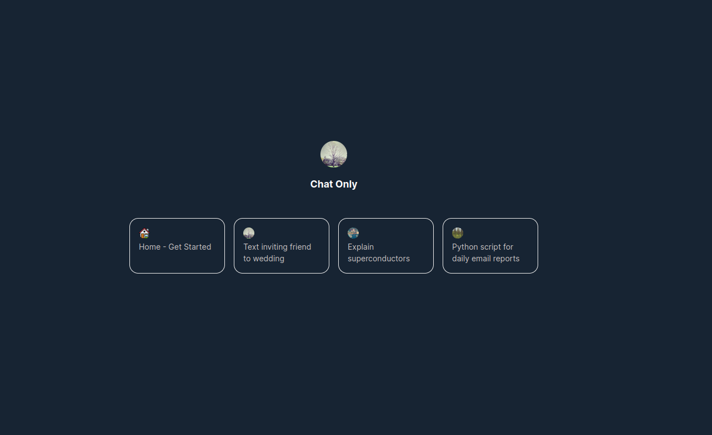
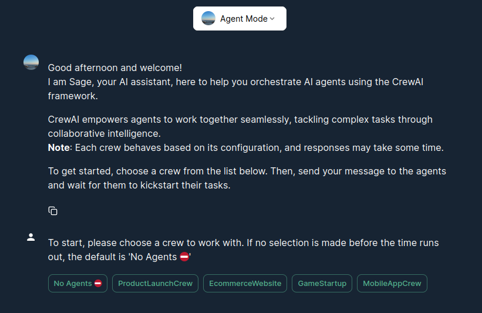

# Sage: Your AI-Powered Data Assistant

Sage: A conversational AI assistant simplifying data interactions with intuitive ease

## Simplify Your Data Interactions with Sage

Sage is a versatile AI assistant designed to enhance your data interaction experience within a container environment. It provides a user-friendly conversational interface for accessing and manipulating data from various sources, all through a **simple configuration file**.

```toml
...

[source]
top_k = 20
refresh_schedule = "1 0 * * SUN"

[source.confluence]
username = "your_confluence_username"
server = "https://yourcompany.atlassian.net/wiki"
spaces = ["SPACE1", "SPACE2"]

...

[source.web]
links = ["https://example.com", "https://anotherexample.com"]
nested = true

[llm]
model = "gpt-4-turbo"

[embedding]
type = "litellm"
model = "text-embedding-3-large"

[reranker]
type = "huggingface"
top_n = 5

[reranker.huggingface]
name = "BAAI/bge-reranker-large"
revision = "708e6d1fff4ba9c97540a97c23dba46b26d87764"

...
```

## The Gateway to Your Data

Sage Chat is the user-friendly interface that connects you to the vast capabilities of Sage. It's where conversations turn into actions, allowing you to seamlessly interact with your entire digital ecosystem.


[Watch the Full Video](https://www.youtube.com/watch?v=gGQecCWPMLs)

Sage enables you to communicate with your data in a natural and intuitive way. Whether you're looking up information, summarizing content, or integrating with external tools, Sage is your personal data assistant, ready to help.

## Key Features

Sage currently offers the following functionalities:

- **Data Source Queries**: Interact with multiple data sources directly through conversational prompts.
- **Integrated Tools**: Access tools like calculators, search engines, and Jira issue summarizers within the chat.
- **Agent Mode**: Activate Sage as an AI agent to handle complex queries and perform autonomous actions.
- **Configuration Simplicity**: Set up Sage quickly by specifying your desired tools and sources in a configuration file.
- **Agent Capabilities**: Utilize Sage in agent mode for advanced tasks.
- **Continuous Source update**: Continuously update the sage data sources via sage's data loader process whenever your data get updated
- **Filter-out Data Source**: Choose to interact with a specific source or all your configured data sources


### Starters: Quick-Tap Launchpad

Starters are predefined prompts designed to provide a seamless initiation into Sage's capabilities. They create a more intuitive experience by offering common queries and source-specific interactions. The following samples showcase examples of starters you can implement:

```yaml
starters:
  - label: "Casual Wedding Invite"
    message: "Draft a casual message to invite a friend as my guest to a wedding next month, ensuring it feels light-hearted and stress-free."
    icon: "https://picsum.photos/200"
  - label: "Superconductors Simplified"
    message: "Describe superconductors in a way that a five-year-old could understand."
    icon: "https://picsum.photos/300"
    source: "Confluence: SF Space Details"
  - label: "Python Email Automation Script"
    message: "Generate a Python script for automating daily email reports, and provide instructions for deployment."
    icon: "https://picsum.photos/400"
    source: "Confluence: Development Docs"
```



Configuring starters is straightforward and requires editing a YAML configuration file. Each starter consists of a user-friendly label, a pre-defined message that sets the context or action for the AI, an optional icon to visually represent the action, and an optional source identifier that specifies the context for the message.

Learn more about [starters configuration](docs/configuration.md#starters-configuration)

### Agent Mode: Build Autonomous AI agents

Agent Mode in Sage allows you to create specialized AI agents that autonomously perform defined roles and tasks. Leveraging the CrewAI framework, these agents collaborate to manage and execute complex projects seamlessly.

**Key Features**:
 - Role Definition: Specify unique roles with goals and backstories.
 - Task Management: Assign clear, actionable tasks to agents.



In Agent Mode, you can define and create crews by specifying their configuration in a YAML file. Here's a quick example below:

```yaml
name: BadassGameTeam

process: sequential

agents:
  - role: Senior Software Engineer
    goal: Create software as needed
    backstory: |
      You are a Senior Software Engineer at a leading tech think tank.
      Your expertise in programming in python and you always do your best to
      produce perfect, working, and complete code.
  
  - role: Software Quality Control Engineer
    goal: create prefect code, by analyzing the code that is given for errors
    backstory: |
      You are a software engineer that specializes in checking code
      for errors. You have an eye for detail and a knack for finding hidden bugs.
      You check for missing imports, variable declarations, mismatched brackets and syntax errors.
      You also check for security vulnerabilities, and logic errors

tasks:
  - description: "You will create a game using python. This is the game instructions: '{input}'"
    agent: Senior Software Engineer
    expected_output: A fully working complete python code. No need for explanation and nothing else either

  - description: |
      You are helping create a game using python. This is the game instructions: '{input}' 
      Using the code you got, check for errors. Check for logic errors, syntax errors, missing imports, variable declarations, mismatched brackets, and security vulnerabilities.
    agent: Software Quality Control Engineer
    expected_output: A fully working complete python code. No need for explanation and nothing else either

```

#### Potential Use Cases and Benefits

1. **Game Development**
   - **Use Case**: Configure agents to handle various game development tasks like designing mechanics, conducting competitor analysis, and creating marketing strategies.
   - **Impact**: Streamlines the development process, enhances collaboration, and fosters innovation.

2. **Content Creation**
   - **Use Case**: Use agents to generate blog posts, social media content, graphics, and videos.
   - **Impact**: Ensures consistent content production, scales efforts, and maintains brand voice.

3. **Customer Support**
   - **Use Case**: Deploy agents to address customer queries, troubleshoot issues, provide product information, and gather feedback.
   - **Impact**: Improves response times, offers personalized support, and collects valuable user insights.

4. **Project Management**
   - **Use Case**: Utilize agents for project planning, task assignment, progress tracking, risk analysis, and milestone reporting.
   - **Impact**: Enhances organization, boosts productivity, and improves accountability.

5. **Market Research**
   - **Use Case**: Engage agents for market analysis, competitor study, customer needs assessment, and trend identification.
   - **Impact**: Informs strategic planning, provides a competitive advantage, and enhances decision-making.

6. **Education and Training**
   - **Use Case**: Configure agents to design curriculums, create educational content, provide tutoring, and assess student performance.
   - **Impact**: Offers customized learning, boosts engagement, and tracks student progress efficiently.


Enjoy the power and flexibility of orchestrating AI agents with Sage and CrewAI!
Learm more about [agents configuration](docs/configuration.md) and see various [examples here](/examples/)

Sage is fully compatible with existing CrewAI definitions, making it easy to port your agents into Sage.

> Tools and Memory support is still in_progress.

## Getting Started with Sage

Begin your journey with Sage in just a few steps:

1. **Installation**: Install Sage following our straightforward installation guide.
2. **Configuration**: Define your tools and sources in the configuration file to tailor Sage to your needs.
3. **Interaction**: Start using Sage Chat to explore the full range of its data interaction capabilities.

For complete guidance, refer to our [Installation Guide](docs/installation.md) and [Configuration Guide](docs/configuration.md)

## Documentation

For more detailed information about Sage's capabilities and how to use it, please refer to the following resources:

- [Tools Overview](docs/tools.md) - Learn about the tools available in Sage and how to use them.
- [LLMs Overview](docs/llms.md) - Understand the Large Language Models supported by Sage.
- [Data Sources](docs/sources.md) - Discover the data sources Sage can interact with and how to configure them.
- [Quick Start Guide](docs/quick_start.md) - Get started with Sage quickly with this simple guide.

## Sage Chat Overview

For an in-depth look at Sage Chat, including its architecture, how it leverages Large Language Models, and tips for getting the best results, please refer to our [Sage Chat Documentation](docs/sage_chat_overview.md).

## Join the Sage Community

Sage is a collaborative project that welcomes contributions from developers and enthusiasts alike. Your input can help us refine and expand Sage's functionality.

Ready to contribute? Please see our [Contributing Guidelines](CONTRIBUTING.md) for more information.

## Support and Feedback

Your feedback is crucial to Sage's development. For assistance, to suggest new features, or to report bugs, please visit our [GitHub Issues](https://github.com/thehapyone/sage/issues) page.

## Appreciation

Special thanks to [Chainlit](https://github.com/Chainlit/chainlit) and the [Langchain](https://github.com/langchain-ai/langchain) project.
